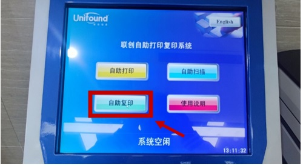
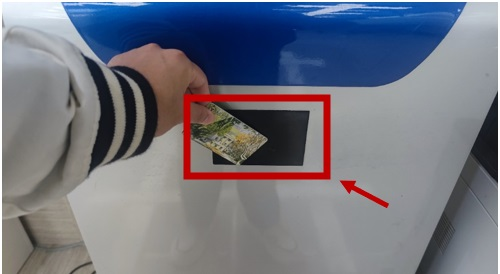
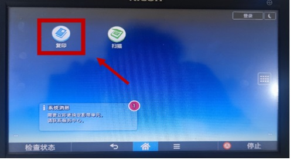
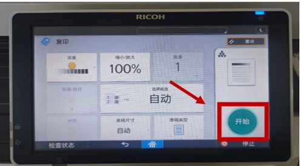
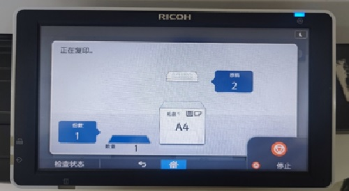

# Self-Service Copier Usage Manual

##Step 1: Start the Copying Process 
* Tap the "Self-Service Copy" icon on the Touch Screen to begin. 

##Step 2: Authenticate with Your Campus Card 
* Swipe your campus card over the sensor area below the screen for authentication. 

##Step 3: Prepare Your Document for Scanning 
* Open the printer lid and place the original document face down on the glass plate, and ensure that the document aligns with the scale indicators. 

##Step 4: Set Copying Parameters 
* Tap the "Copy" icon on the copier screen to begin, and configure the copying settings 

##Step 5: Start the Copying Process 
* Press the "Start" button on the screen to begin copying. 

##Step 6: Collect Your Documents 
* After copying, remember to take your original documents and copies. 

##Step 7: End copying process Swipe card and pay fees.
