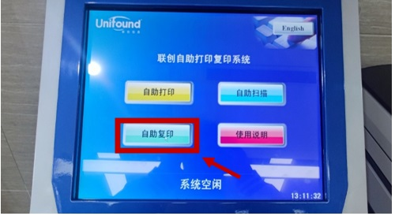
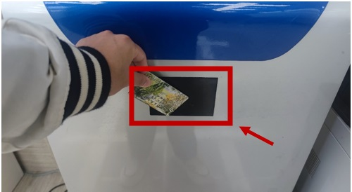
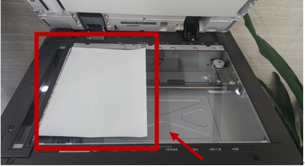
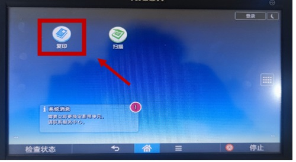
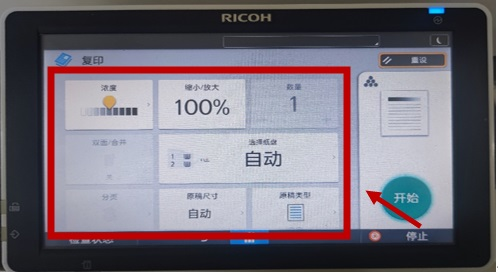
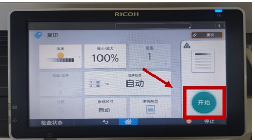
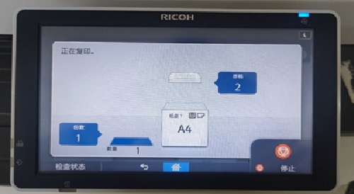
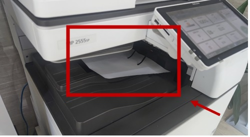
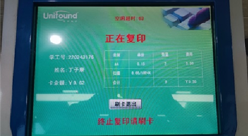

# 自助复印使用手册

## 步骤 1: 开始复印流程
* 轻触触摸屏上的“自助复印”图标以开始。

## 步骤 2: 使用校园卡进行身份验证
* 将校园卡在屏幕下方的感应区域轻轻刷过以进行身份验证。

## 步骤 3: 准备文件进行扫描
* 打开打印机盖，将原始文件正面朝下放在玻璃板上，确保文件对齐刻度指示线。

## 步骤 4: 设置复印参数
* 轻触复印机屏幕上的“复印”图标，开始设置复印参数。

## 步骤 5: 开始复印流程
* 按下屏幕上的“开始”按钮，开始复印。

## 步骤 6: 取走文件
* 复印结束后，记得取走你的原件和复印件。

## 步骤 7: 结束复印流程，刷卡并支付费用

