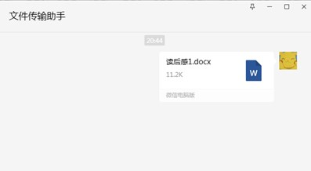
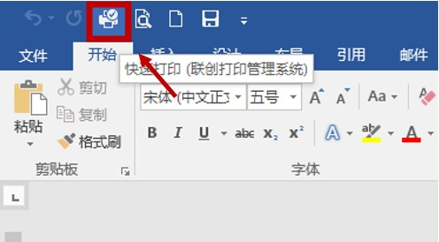
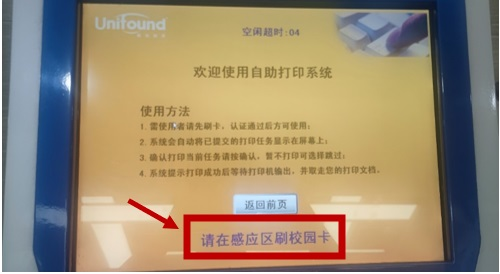
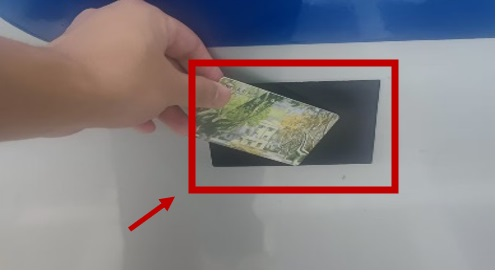
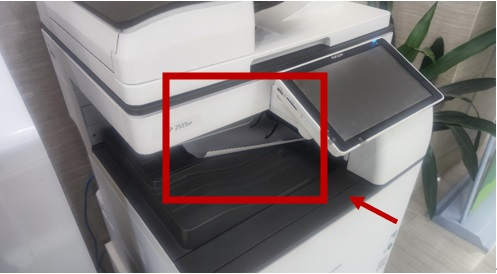

# Self-Service Print Usage Manual

## Step 1: Transfer Files

* Log in to WeChat and upload the files to be printed through WeChat.
{: style="display: block; margin:auto 50px; " }
## Step 2:Save and Open the File
* Log in to WeChat and upload the files to be printed through WeChat.
 

##Step 3: Select print options and Set print requirements 
* Select the printing option in word, log in to "Lianchuang Printing Management System", input campus card number and password, and then set the printing requirements 

##Step 4: Swipe the Card and Start Printing 
* Select ‘Self-Service Printing’ on the stage, swipe the card in the sensing area and start printing  

* Step 5: Take away the File and Finish Printing 

!!! tip 
    * The download time will be longer when printing PDF files or other large files. Please be patient! 
    * Upload and print PDF files in sections, please no more than 100 pages!