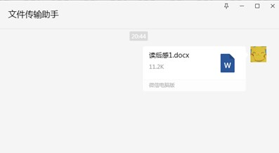
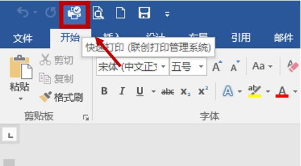
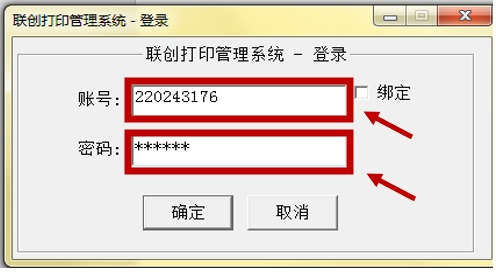
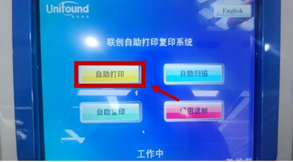
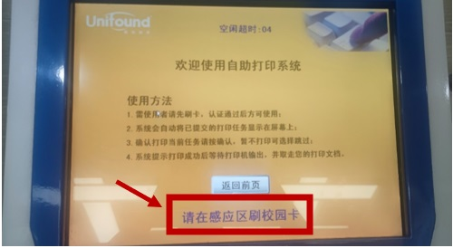
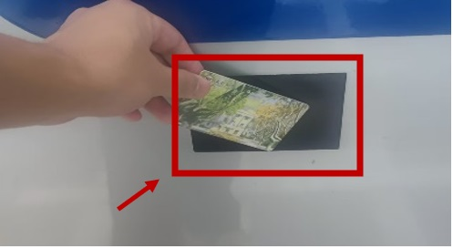
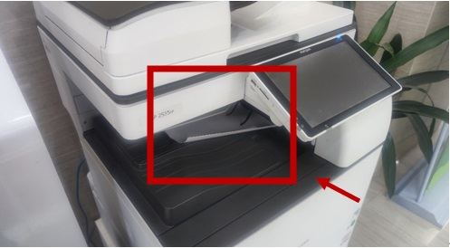

# 自助打印使用手册

## 步骤 1: 传输文件

* 登录微信，通过微信上传需要打印的文件。  
{: style="display: block; margin: auto 50px;" }

## 步骤 2: 保存并打开文件

* 登录微信，通过微信上传需要打印的文件。  

## 步骤 3: 选择打印选项并设置打印要求

* 在 Word 中选择打印选项，登录“联创打印管理系统”，输入校园卡号和密码，然后设置打印要求。  
  

## 步骤 4: 刷卡并开始打印

* 在终端选择“自助打印”，在感应区域刷卡并开始打印。  
  
  

## 步骤 5: 取走文件并完成打印

!!! tip
    * 打印 PDF 文件或其他大型文件时，下载时间会更长，请耐心等待！
    * 请将 PDF 文件分段上传和打印，页数请不要超过 100 页！
