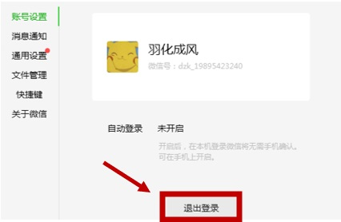

# Safety Precautions

##7.1. Protect personal privacy 
* Make sure that the printed documents are taken away in time after the printing. 
* Remember to exit WeChat after printing. 

##7.2. Compliance with the regulations of use 
* Abide by copyright laws and do not print infringing documents or pirated materials. 
##7.3. Pay attention to equipment maintenance 
* Before use, please check whether the printer is working normally. If there is any abnormal situation, please report to repair in time.